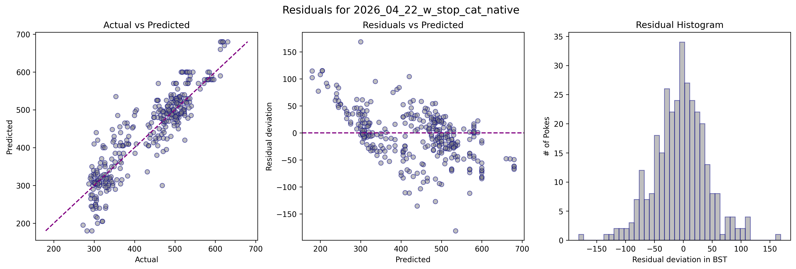
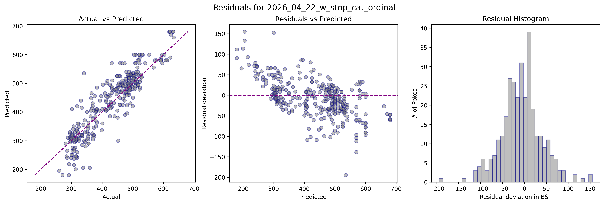
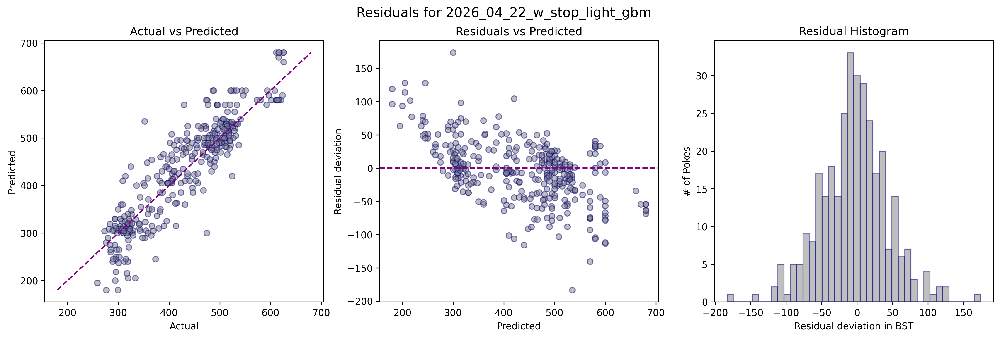

# PoKemon ML Predictor

- This project aims to predict the `BST`, known as `total_stats` (sum of base stats: HP + atk + def + sp.atk + sp.def + spe) for existing and future Pokémon generations using ML.

- The project will train different models and will dive down in feature engineering inspired by zoomorphology, the biology discipline that studies animal shapes. This will provide a further boost to the model predictions. 

- Game Freak, the Pokemon videogame developers, are probably biased by nature when creating pokemons. In that sense, these creatures should follow this underlying bias and their properties, like `BST` are secretly related to this nature imprint.

- For detailed explanations on this project and exploration data analysis, see [PDF_DOCUMENTATION](documentation/ml_pokemon_documentation.pdf)

## Predicted values for New Generation Pokemon
<table align="center">
  <tr>
    <td align="center"></td>
    <td align="center"></td>
    <td align="center"></td>
  </tr>
</table>

<!-- PREDICTIONS -->

|  Unnamed: 0  |  Browt   |  Pombon  |  Gecqua  |
|:------------:|:--------:|:--------:|:--------:|
|  cat_native  | 293 ± 39 | 310 ± 6  | 304 ± 20 |
| cat_ordinal  | 277 ± 33 | 299 ± 42 | 289 ± 47 |
|  light_gbm   | 288 ± 62 | 316 ± 25 | 311 ± 41 |
<!-- PREDICTIONS -->

## Metrics leaderboard (best current iteration) for 3 different models

<!-- LEADERBOARD -->

|    model    |  tr_R2  |  tr_RMSE  |  tr_MAE  |  val_R2  |  val_RMSE  |  val_MAE  |  overfit_R2  |  overfit_RMSE  |  max_res  |
|:-----------:|:-------:|:---------:|:--------:|:--------:|:----------:|:---------:|:------------:|:--------------:|:---------:|
| cat_native  |  0.84   |   45.18   |  32.53   |   0.82   |   46.34    |   35.14   |     0.02     |     -1.16      |  181.16   |
| cat_ordinal |  0.83   |   46.51   |  34.45   |   0.82   |   46.74    |   35.52   |     0.02     |     -0.22      |  194.43   |
|  light_gbm  |  0.86   |   42.22   |  31.68   |   0.81   |   47.54    |   36.01   |     0.05     |     -5.32      |  183.33   |
<!-- LEADERBOARD -->

<!-- THIS NEEDS TO BE CHANGED MANUALLY? THINK HOW TO REPLACE PLOTS-->
### Plots

<table align="center">
  <tr>
    <tr align="center"></tr>
    <tr align="center"></tr>
    <tr align="center"></tr>
  </tr>
</table>

