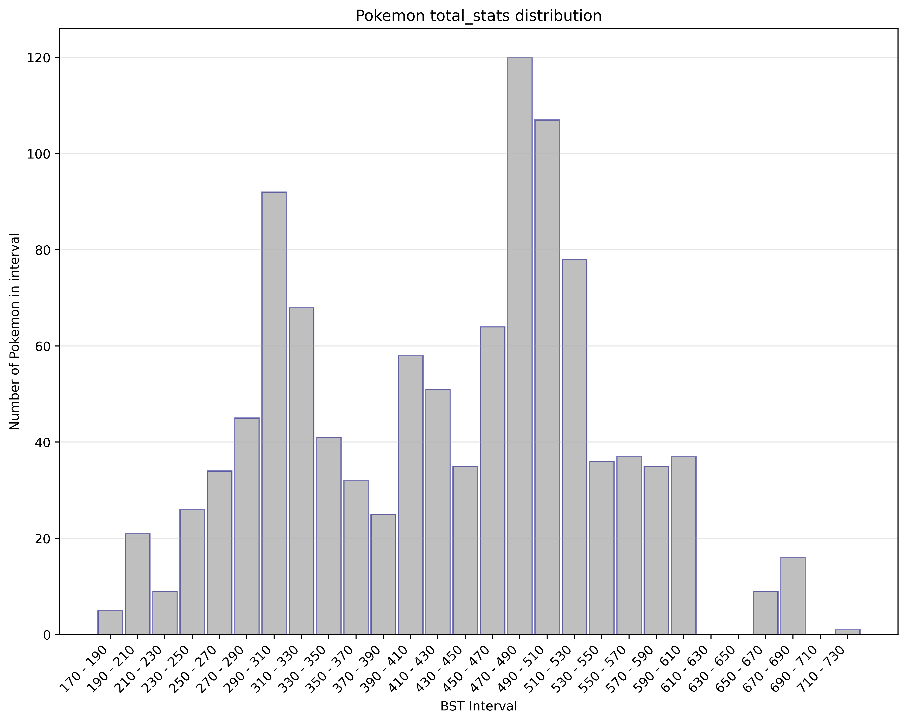
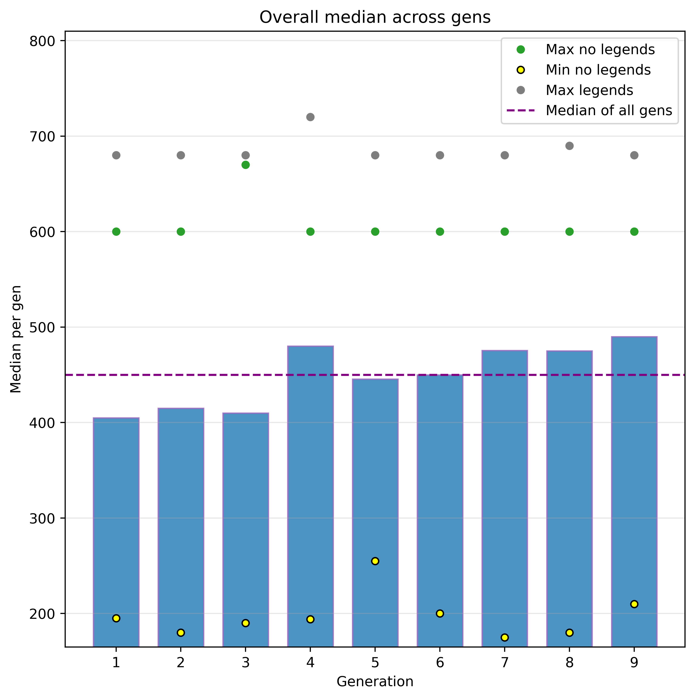
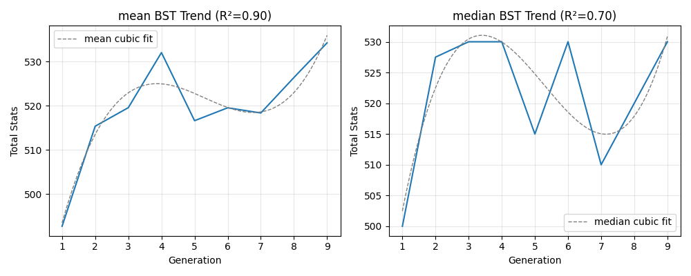
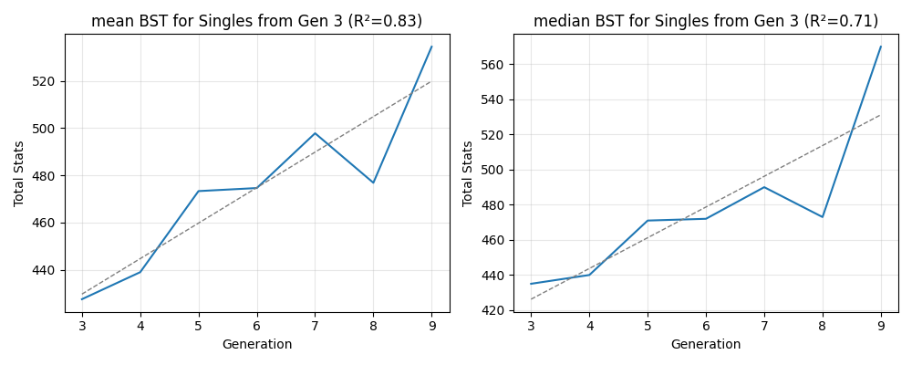
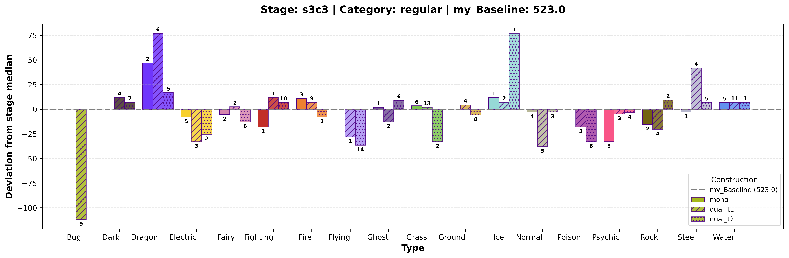
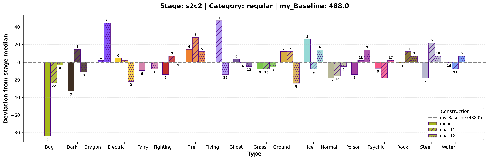
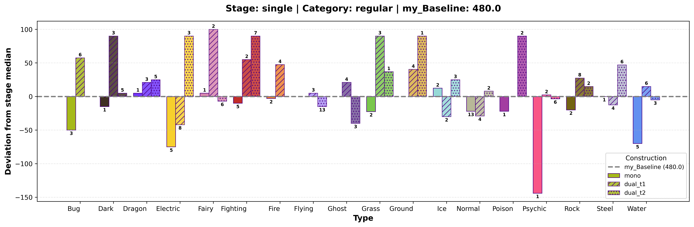
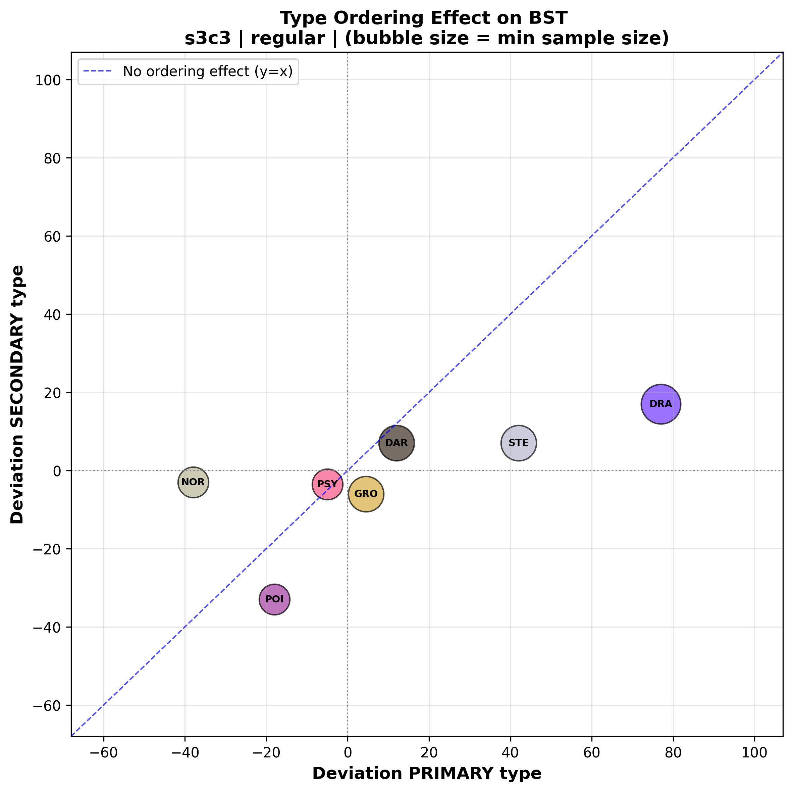
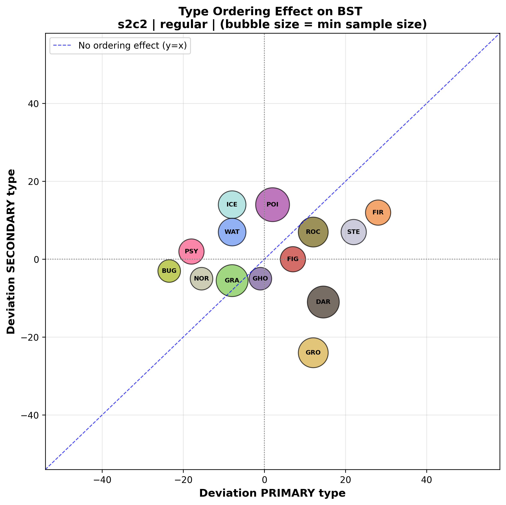
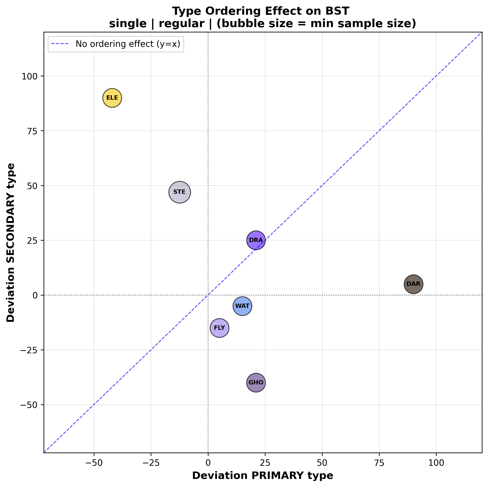

LOAD THIS IN DOCU. KEEP SUMMARY IN README.

## Table of Contents

- [Dataset Features (Our initial Pokedex)](#features-description-our-initial-pokedex)
- [Data Analysis](#data-analysis)
  - [BST Distribution Across Generations](#bst-distribution-across-generations)
  - [Polynomial Fits](#polynomial-fits)
- [Type Order Impact Analysis](#type-order-impact-analysis)
  - [Type Deviations](#type-deviations)
  - [Dual-Type Order](#dual-type-order)
- [Next Steps](#next-steps)

## Feature's Description (Our initial Pokedex*)
(The pokedex is the animal atlas of the pokemon world. It collects information of all known species)

Every pokemon can be categorised based on its basic attributes:
- `BST`: base stat points. In general terms, it describes how "strong" a pokemon is. It ranges from 175 to 720.
- `type(s)`: like `Electric` (i.e. Pikachu), `Fire`/`Flying` (i.e. Charizard), etc. Total 18 different ones as unique or pairs of.
- `height`: 0.1 to 20 m.
- `weight`: 0.1 to 999.9 kg.
- `color`: The main color of the pokemon. See [this link](https://bulbapedia.bulbagarden.net/wiki/List_of_Pok%C3%A9mon_by_shape) for more information
- `shape`: There are 14 different shapes (`upright`, `quadruped`, etc.). See [this link](https://bulbapedia.bulbagarden.net/wiki/List_of_Pok%C3%A9mon_by_color) for more information
- `stage`: Pokemon can evolve. A pokemon cannot evolve more than 2 times. See [next section](#power-creep-analysis) for further information.
- `category`: Majority of Pokemon belong to the `regular` category. There are `legendary` ones like Articuno, Moltres, Mewtwo. And `mythical` ones, like Mew.

Game Freak, the Pokemon Company, usually provide the first three ones when a new Pokemon is announced. (For example, see these three [new pokemon](https://windswaves.pokemon.com/en-us/) for the new games to come in 2027). The rest of the `features` (`color`, `shape`, `stage` and `category`) are easily extracted from visuals and little experience within the franchise. `Stage` requires more experience with the franchise (i.e. one would never expect a Charizard to be the first stage of an evolution chain of two stages!, but other pokemon, like [Archaludon](https://bulbapedia.bulbagarden.net/wiki/Archaludon_(Pok%C3%A9mon)) could be hard to determine at sight).

[Next section](#power-creep-analysis) will be devoted to extract information from all these features. In this way, we will get further insights on how each are related to each other and which ones can be combined to create secondary features through feature engineering.

## Data Analysis:

### 1. BST Distribution Across Generations

Pokemon is an old franchised which started in 1996. Therefore, not all 1082 different species were "discovered" by years. Which each new generation of games, new pokemon are included, increasing the quantity of this creatures. We can then first explore how these `BST` values have changed since 1996.

<!-- NO <style> needed -->
<table align="center" style="table-layout: fixed; width: 100%; max-width: 1400px;">
<tr>
<td style="width: 60%; padding: 20px;">
  
   <strong>BST Intervals</strong>
</td>
<td style="width: 40%; padding: 20px;">
  
   <strong>Median Evolution</strong>
</td>
</tr>
</table>
>

In the first plot we can see how pokemon are distributed from the minimal value of `BST` the maximum one in intervals of 20 units. In fact, we see that there are two main cluster intervals; (270-330) and (450-490). We will later see what these correspond to when comparing to the `stage` in the evolution chain.

The second plot shows the median of `BST` for each generation that has been released in the last 30 years. This median seems to agree with the second cluster of `BST` in the first image. Overall, we can see that the median has been increasing over generations. This may point to the fact that there exists some power-creep (i.e. pokemon are getting stronger and stronger designs in each generation) that could be useful to account for when training the model.

The second plot also displays the mininum and maximum value of `BST` for each generation (corresponding to one or more pokemon in that generation). We can also the overall median across all generation. It is also worth noting the behaviour of min/max values for each generation.

  * The minimum value seems to be under or equal to 200 points, with generations 5th and 9th with outliers.
  * On the oher hand, if we exclude `legendary` pokemon, we see that the maximum value for `BST` of `non-legendary` pokemon is quite constant accross generation, except for generation 3*. This seems to impose an upper limit for any `non-legendary` pokemon that has not been broken in a long time.
  * For `legendary` pokemon we see the value seems also to be limited up by 700 points. Only generation 4 crossed this barrier (Arceus, the "God" of all pokemon was introduced in this generation)

Summary BST accross generation:

- `BST` seems to cluster around (270-310) and (450-490)
- `BST` seems to increase a little each generation
- `BST` max for `regular` pokemon looks limited at 600.

  (* Game Freak designers were slaking off in that generation)
  

### 2. BST distribution by evolution chain stage and category

Let us now explore how the `BST` behaves for each evolution chain stage and category. First, it is important to explain how we are going to catalogue each stage.

- `Babies2` -> First stage of an evolution chain of 2 stages. (i.e. Ekans, Ratatta, etc)
- `Babies3` -> First stage of an evolution chain of 3 stages. (i.e. Charmander)
- `F2` -> Second stage of an evolution chain of 2 stages. (i.e. Sandlash)
- `F3` -> Third stage of an evolution chain of 3 stages. (i.e. Charizard)
- `Inter` -> Second stage of an evolution chain of 3 stages. (i.e. Charmeleon)
- `Single` -> No evolution chain. (i.e. Ditto)

<table align="center" style="table-layout: fixed; width: 100%; max-width: 1400px; margin: 30px 0;">
<tr>
<td style="width: 60%; padding: 20px; vertical-align: top;">
  
  

    BST Intervals Distribution
  

</td>
<td style="width: 40%; padding: 20px; vertical-align: top;">
  
  

    Median Evolution by Generation
  

</td>
</tr>
</table>

Here we can also extract juicy information:
- **F3 (final stage, 3-stage chain):** This trend seems to follow a cubic polynomial around the median.
- **Babies (pre-evo):** No clear pattern regardless of chain length.
- **Singles:** While generations 1 and 2 had powerful single evolution pokemon, it decreased in the two following ones and kept a steady growth from Gen 5.
- **Inter (stage 2 of 3):** This seems to nicely adjust to the overall median across generation. However, there is a slight favorability from Gen 7+.
- **Legendaries:** Gen 7 dip due to Cosmog line, which is a `legendary` pokemon with an evolution chain of 3 stages.

In fact, it could be illuminating if we try to fit different polynomials to 2 clear patterns in F3 and Singles (from third generation onwards)

**F3 Mean/Median (cubic fit):**

<table align="center" style="table-layout: fixed; width: 80%;">
<tr>
<td style="width: 100%; padding: 15px;">
  <!-- OVERRIDE: width: 100% fills text, height: auto keeps ratio -->
  
  

    <strong>F3 polynomial fit</strong>
  

</td>
</tr>
</table>

The R² > 0.7 for the median indicates strong ongoing trend! This can result useful for **feature engineering!**

**Singles Linear Fit (Gen 3+):**

<table align="center" style="table-layout: fixed; width: 80%;">
<tr>
<td style="width: 100%; padding: 15px;">
  <!-- OVERRIDE: width: 100% fills text, height: auto keeps ratio -->
  
  

    <strong>Singles linear fit</strong>
  

</td>
</tr>
</table>

As we suspected, the median trend for this stage is quite strong also, R² ≈ 0.7. This can also be important to keep in mind when **feature engineer** new attributes.

Summary BST for stage and category:

- `BST` for the final `stage` of an evolution chain of 3 has followed a clear cubic trend.
- `BST` for `single` stage has grown steadily since generation 3.

## Type Order Impact Analysis

### Type Deviations from Stage Medians (Non-Legendaries)

<td></td>
<td></td>
<td></td>

**Insights:**
- **Bug type:** Major negative deviation as primary/mono-type in finals/singles.
- **Normal type:** Negative except as secondary in singles (positive boost).
- **Dragon:** Consistently boosts BST regardless of position.
- **Fire/Water:** Strong in specific stages (S2c2/S3c3).
- **Missing combos:** No mono-Bug F3; no mono-Flying (non-legendary).

### Dual-Type Order Effects (≥3 Pokémon per combo)

<table><tr>
<td></td>
<td></td>
<td></td>
</tr></table>

What do I see here?

- Well, I will focus on final stages, as it seems are the ones with enough population to make comparisons.
  - All types in quadrant I will contribute positively to the overall mean. However, we do some how care on how much they do deviate from the m=1 line. If they lied on this line, it would mean typing ordering may not play much role on overall stats. However, there seems to be great outliers.
  - For s2c2, we see that grass, ghost, fighting and rock have the same weight on the type, no matter what if type 1 or 2. Dark and Ground loose value when added as second type. For ground, this seems to repeat also for s3c3. 
  - For s3c3, Oh mamma mia with dragon, that is brutal! As first type it deviates like 80 points (which makes sense, as all titans are limited to 600 BST but s3c3 mean is 523.)
  - Steel plays a similar role. 

  (I am not sure if renormalising from s3c3 to s2c2 could be useful. I mean, doing so, if one accounts for the polynomial s3c3 behaviour somehow, could provide a greater pull of types that will get a minimum sample of more than 3. This can provide information enough of how each type behaves and add some given weights for feature engineering)

### ✅ **Strengths**
- Pooling s3c3/singles → s2c2: +190 samples (46% boost), reveals rare type orders (n<3 → >5).
- Poly-aligned scaling realistic (~0.78-0.91x gen-dependent).
- Type deviation feats high-value (order_delta → R² +0.02-0.05).

### ⚠️ **Flaws Fixed**
1. **s2c2 NOT trendless**: Quad R²~0.6 (390→470 Gen1-9). **Fix**: Poly fit all stages.
2. **Synth contamination**: s3c3 biases pollute s2c2. **Fix**: Weights (native=1.0 > synth=0.3-0.6).

*Work in progress—stay tuned for model results!*
